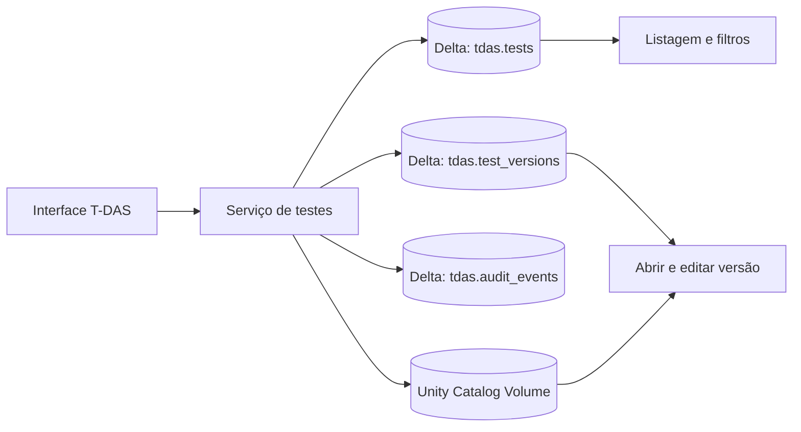

# Arquitetura e planejamento: testes salvos do T-DAS

**Status:** proposta para discussão  
**Data:** 28/09/2026

## Objetivo

Permitir que uma pessoa salve no T-DAS um teste processado, consulte-o depois, reabra-o para edição e mantenha o histórico de alterações. A funcionalidade trata dos testes enviados e processados no T-DAS; não altera o cadastro de canais do Visualizador de Canais.

## Princípios

- Separar os testes salvos das tabelas atuais de configuração, como `dados_iniciais`.
- Preservar os dados de cada salvamento como uma versão imutável.
- Manter os dados tabulares em tabelas Delta e os arquivos em um Unity Catalog Volume.
- Não depender do disco local nem do estado de sessão do Streamlit para persistência: esses estados podem desaparecer em reinicializações.
- Registrar o usuário, horário, ação e campos alterados em cada operação.

## Componentes propostos



### Tabelas Delta

Criar um schema de aplicação separado, por exemplo `eng_lab.tdas_app`. Os nomes abaixo são propostas; devem ser confirmados com quem administra o catálogo.

#### `tdas_app.tests` — estado atual do teste

Uma linha por teste, com campos como:

| Campo | Uso |
|---|---|
| `test_id` | UUID estável do teste |
| `title` | Nome exibido na listagem |
| `project`, `test_type`, `vehicle_type`, `test_date` | Campos usados para busca e filtros |
| `current_version` | Número da versão vigente |
| `status` | `ACTIVE` ou `DELETED` |
| `created_by`, `created_at` | Autoria e data de criação |
| `updated_by`, `updated_at` | Última alteração |
| `deleted_by`, `deleted_at` | Exclusão lógica, se aplicável |

Campos estáveis e usados em filtros devem ser colunas tipadas. Metadados menos comuns podem ficar em JSON, evitando uma migração por cada novo campo opcional.

#### `tdas_app.test_versions` — snapshots imutáveis

Uma linha por versão de um teste:

| Campo | Uso |
|---|---|
| `test_id`, `version_no` | Identificam o teste e a versão |
| `saved_at`, `saved_by` | Quando e por quem foi salva |
| `change_reason` | Motivo informado, opcional |
| `processing_config_json` | Opções usadas no processamento |
| `metadata_json` | Metadados completos daquela versão |
| `processed_data_path` | Caminho dos dados processados no volume |
| `source_file_path` | Caminho do arquivo original, se retido |
| `source_file_name`, `source_checksum` | Identificação e verificação do original |

Cada edição cria um novo `version_no`; não atualiza o snapshot anterior. A versão atual é indicada por `tests.current_version`.

#### `tdas_app.audit_events` — auditoria da aplicação

Uma linha por ação, com `event_id`, `test_id`, `version_no`, `action` (`CREATED`, `UPDATED`, `DELETED`, `RESTORED`), `actor`, `occurred_at`, `changed_fields_json`, `before_json`, `after_json` e `reason`.

A auditoria registra a intenção do usuário e os campos alterados. O histórico técnico do Delta pode complementar essa trilha, mas não a substitui.

### Unity Catalog Volume — arquivos

Armazenar os arquivos enviados e os dados processados em caminhos por teste e versão, por exemplo:

```text
/Volumes/<catalog>/<schema>/<volume>/tdas/tests/<test_id>/source/<arquivo-original>
/Volumes/<catalog>/<schema>/<volume>/tdas/tests/<test_id>/versions/<version_no>/processed.parquet
```

O Parquet preserva o DataFrame processado, inclusive colunas que variem entre formatos de entrada. O arquivo original permite reprocessar o teste. Figuras e PDFs podem ser recriados sob demanda, em vez de serem a fonte dos dados.

## Fluxos da aplicação

### Processar e salvar

1. A pessoa envia e processa um arquivo como faz hoje.
2. O T-DAS apresenta os metadados identificados e permite completar o título e demais campos de busca.
3. Ao selecionar **Salvar teste**, a aplicação cria um `test_id`, persiste o original e os dados processados no volume e cria a versão 1.
4. A aplicação grava os registros de teste e auditoria e confirma o salvamento com o identificador do teste.

Se uma etapa falhar, a aplicação deve reportar o erro e evitar mostrar o teste como salvo. A escrita dos arquivos e das tabelas precisa ser idempotente para que uma repetição após falha não duplique testes.

### Listar e abrir

- Uma nova seção do T-DAS, **Testes cadastrados**, consulta apenas testes com `status = 'ACTIVE'`.
- A listagem deve permitir pesquisar e filtrar por projeto, tipo de teste, data, veículo, autor e última atualização.
- **Abrir** carrega os metadados e a versão atual para a sessão do Streamlit; as análises e exportações são regeneradas a partir dela.

### Editar e auditar

- **Editar** carrega uma versão para edição.
- Ao salvar, a aplicação compara os dados com a versão aberta e grava um novo snapshot e um evento de auditoria.
- A aplicação compara a versão aberta com `current_version`. Se outra pessoa salvou antes, mostra conflito e pede para recarregar; não sobrescreve silenciosamente.
- A interface pode mostrar a lista de versões e permitir consultar versões anteriores. Restaurar uma versão antiga cria uma nova versão baseada naquele conteúdo; não apaga o histórico posterior.

### Excluir

- **Excluir** faz exclusão lógica: marca `status = 'DELETED'`, grava autor e horário e cria evento de auditoria.
- A listagem normal esconde testes excluídos; uma tela com permissão pode permitir restaurá-los.
- Remover arquivos permanentemente deve ser uma política separada de retenção, pois elimina a possibilidade de restauração.

## Escopo incremental

### Fase 1 — persistência e consulta

- Confirmar campos obrigatórios e tamanho/formatos máximos de upload.
- Criar tabelas Delta, volume e permissões para a identidade do Databricks App.
- Implementar identificador do teste, salvamento inicial e listagem com busca/filtros.
- Reabrir um teste salvo e regenerar visualizações/exportações.

### Fase 2 — edição e trilha de auditoria

- Definir precisamente os campos editáveis.
- Criar versões imutáveis e eventos de auditoria.
- Implementar histórico, conflito de versões e restauração por nova versão.

### Fase 3 — exclusão, operação e retenção

- Implementar exclusão lógica e restauração controlada.
- Definir retenção de arquivos originais e processados, limite de tamanho e eventual limpeza definitiva.
- Validar permissões, concorrência, falhas parciais e recuperação.

## Critérios de aceite

- Um teste salvo continua disponível após sair da sessão, reiniciar ou redeployar o app.
- A listagem permite localizar e abrir um teste salvo.
- Uma edição produz nova versão e deixa as versões anteriores consultáveis.
- A auditoria identifica ator, horário, operação e campos alterados.
- Excluir não apaga imediatamente os dados e a ação fica auditada.
- O app detecta edição concorrente e não perde alterações silenciosamente.
- Arquivos persistidos podem ser lidos pela identidade de serviço do app com permissões mínimas necessárias.

## Passo a passo de implementação

Executar as etapas na ordem abaixo. Cada etapa deve ficar utilizável antes de avançar para a seguinte; assim validamos persistência e recuperação antes de adicionar edição e exclusão.

### Etapa 0 — fechar decisões e preparar o ambiente

1. Definir quem pode listar, salvar, editar, excluir e restaurar testes.
2. Definir campos obrigatórios para o cadastro e para a listagem. Como ponto de partida: projeto, tipo de prova, tipo de veículo, data do teste e nome do arquivo.
3. Definir limite de tamanho de upload e retenção do arquivo original e das versões processadas.
4. Confirmar com o administrador o catálogo, schema e warehouse que o T-DAS usará.
5. Guardar credenciais fora do código e verificar que a identidade usada pelo app não depende de arquivos locais temporários.

**Entregável:** decisões registradas e ambiente Databricks de desenvolvimento disponível.

### Etapa 1 — provisionar armazenamento e permissões

1. Criar o schema de aplicação, por exemplo `eng_lab.tdas_app`.
2. Criar o Unity Catalog Volume para originais e DataFrames processados.
3. Criar `tests`, `test_versions` e `audit_events` conforme o modelo deste documento.
4. Definir chaves lógicas e colunas obrigatórias; não depender de constraint de chave primária como mecanismo único contra duplicação.
5. Conceder à identidade do Databricks App apenas os privilégios necessários para ler/gravar as tabelas e ler/gravar no volume.
6. Validar que a mesma identidade consegue gravar e reler um arquivo pequeno e inserir/consultar registros de desenvolvimento.

**Entregável:** infraestrutura persistente criada e acessível pelo app.

### Etapa 2 — criar a camada de persistência no código

Extrair a persistência do arquivo grande `modules/tdas/page.py` para módulos menores, sem alterar a lógica de processamento:

- `modules/tdas/persistence/models.py`: estruturas de metadados e versão usadas entre interface e persistência.
- `modules/tdas/persistence/storage.py`: gravar, ler e excluir arquivos no Volume.
- `modules/tdas/persistence/repository.py`: operações SQL sobre as três tabelas.
- `modules/tdas/persistence/service.py`: orquestrar operações completas e validações.

Implementar primeiro funções pequenas: `create_test`, `save_version`, `list_tests`, `get_test`, `get_test_version`, `soft_delete_test` e `restore_test`. Centralizar escaping/parâmetros SQL, tratamento de erro e logs sem incluir dados sensíveis nos logs.

**Entregável:** persistência exercitável sem depender da interface Streamlit.

### Etapa 3 — salvar o primeiro teste processado

1. Localizar no fluxo atual de `render_tdas()` o ponto em que o processamento termina e o DataFrame final está pronto. A entrada acontece pelo `st.file_uploader` e pelo fluxo `carregar_e_tratar_dados`; preservar essas funções.
2. Montar um objeto de metadados validado com os campos decididos na Etapa 0 e as opções efetivamente usadas no processamento.
3. Gerar `test_id` no servidor e calcular checksum do arquivo original para identificar reenvios acidentais.
4. Copiar os bytes do upload antes de qualquer processamento que consuma ou reposicione o arquivo; salvar o original no caminho do teste no Volume.
5. Gravar o DataFrame processado em Parquet em um diretório temporário daquele teste; após confirmar a escrita, promover para o caminho da versão 1.
6. Inserir o cabeçalho, a versão 1 e o evento `CREATED`. Definir uma estratégia de retomada/limpeza para falha entre gravação de arquivo e gravação Delta.
7. Mostrar confirmação com o identificador e incluir botão **Salvar teste** apenas quando houver resultado processado válido.
8. Tornar a ação idempotente: duplo clique ou retry da mesma requisição não deve criar dois testes.

**Entregável:** um teste processado pode ser salvo e permanece no armazenamento após reiniciar a sessão.

### Etapa 4 — construir a listagem de testes

1. Criar uma visão/seção **Testes cadastrados** dentro do T-DAS.
2. Consultar apenas cabeçalhos ativos, ordenando por atualização mais recente.
3. Implementar pesquisa por nome/arquivo e filtros pelos campos da Etapa 0; limitar resultados e carregar páginas para a tabela não crescer sem limite.
4. Exibir pelo menos nome, projeto, tipo de teste, data, versão, autor e última atualização.
5. Adicionar ações **Abrir** e, inicialmente, apenas um placeholder para **Editar** e **Excluir** até essas etapas estarem prontas.

**Entregável:** o usuário encontra os testes salvos e pode abrir um deles.

### Etapa 5 — reabrir e regenerar a análise

1. Ao abrir um `test_id`, buscar o cabeçalho e a versão atual.
2. Ler o Parquet versionado do Volume e reconstruir o DataFrame com tipos e colunas preservados.
3. Restaurar os metadados e parâmetros da versão para o `session_state`, usando uma chave de sessão que inclua o `test_id`.
4. Reutilizar a renderização de gráficos, tabelas e exportações existente, sem reprocessar o arquivo original na abertura normal.
5. Tratar arquivo ausente, versão incompleta ou incompatibilidade de esquema com erro visível e log com `test_id`.

**Entregável:** abrir um teste salvo reproduz a visualização e permite gerar novamente os arquivos de saída.

### Etapa 6 — implementar edição versionada e conflito

1. Definir quais metadados e opções de processamento ficam editáveis. Nesta primeira versão, não permitir edição célula a célula das amostras.
2. Carregar o número da versão aberta como `base_version`.
3. No salvamento, validar os campos e comparar `base_version` com `tests.current_version`.
4. Se divergirem, interromper o salvamento e pedir recarga; não sobrescrever alterações concorrentes.
5. Persistir os arquivos alterados em um novo diretório de versão, inserir novo snapshot e evento `UPDATED`, e só então atualizar a versão corrente.
6. Registrar diff de campos antes/depois e usuário autenticado. Se falhar parte da operação, deixar a versão incompleta identificável e não apontá-la como atual.
7. Adicionar tela de histórico que permita abrir versões antigas em modo somente leitura.

**Entregável:** editar e salvar cria uma nova versão auditável sem apagar a anterior.

### Etapa 7 — implementar exclusão lógica e restauração

1. Exigir confirmação antes da exclusão.
2. Marcar cabeçalho como `DELETED`, registrar autor/data e inserir evento `DELETED`; não remover imediatamente os arquivos.
3. Filtrar excluídos da listagem principal e oferecer restauração somente a perfis autorizados.
4. Restaurar muda o estado para ativo e grava evento `RESTORED`; a trilha anterior permanece.
5. Só automatizar exclusão física depois de aprovar política de retenção, backup e responsabilidades.

**Entregável:** excluir/recuperar é auditável e não destrói versões acidentalmente.

### Etapa 8 — validar, publicar e operar

Validar pelo menos estes cenários em um ambiente de desenvolvimento:

- salvar cada formato de arquivo aceito e reabrir o resultado após reiniciar o app;
- nome repetido, upload duplicado, arquivo grande, falha de rede e retry;
- duas sessões editando a mesma versão;
- falha entre salvar arquivo no Volume e gravar as tabelas;
- exclusão, restauração e consulta ao histórico;
- usuário sem permissão e erro de leitura/gravação;
- volume de dados maior que o conjunto de exemplo e paginação da listagem.

Depois da validação, publicar primeiro para um grupo pequeno, monitorar erros e tempo de leitura/gravação e só então liberar para todos. Confirmar antes da publicação que o schema, volume, permissões e política de retenção também existem no ambiente de produção.

**Entregável:** funcionalidade publicada com roteiro de suporte e operação.

### Ordem sugerida dos incrementos

1. Infraestrutura + salvar teste.
2. Listagem + abrir e regenerar.
3. Edição com nova versão + auditoria.
4. Exclusão lógica + restauração.
5. Permissões refinadas, retenção e melhorias de escala.

Não implementar edição manual de milhares/milhões de amostras na primeira entrega. Se essa necessidade for confirmada, planejar separadamente interface, armazenamento, limites e auditoria dessas alterações.

## Decisões pendentes antes da implementação

1. A edição abrange apenas metadados e parâmetros de processamento, ou também valores dos sinais/amostras?
2. Por quanto tempo o arquivo original e cada versão processada devem ser retidos?
3. Quem pode listar, editar, excluir e restaurar testes? Todos os usuários do app terão acesso aos mesmos testes?
4. O nome do teste será digitado ou montado a partir de projeto, tipo, veículo e data?
5. Qual tamanho máximo de upload e volume esperado de testes devem ser suportados?

**Recomendação inicial:** permitir edição de metadados e parâmetros; manter cada DataFrame processado como Parquet versionado; manter o original conforme uma política de retenção aprovada. Edição direta de amostras pode ser adicionada depois, caso seja requisito real.

## Permissões e documentação Databricks

A identidade de serviço do app precisa de permissões para consultar/gravar as tabelas e ler/gravar no volume. A configuração exata deve ser aplicada no workspace e no Unity Catalog.

- [Estado persistente em Databricks Apps](https://docs.databricks.com/gcp/en/dev-tools/databricks-apps/key-concepts)
- [Unity Catalog Volumes](https://docs.databricks.com/aws/en/volumes)
- [Adicionar Volume como recurso a um Databricks App](https://docs.databricks.com/aws/en/dev-tools/databricks-apps/uc-volumes)
- [Histórico de tabelas Delta](https://docs.databricks.com/aws/en/tables/history)
